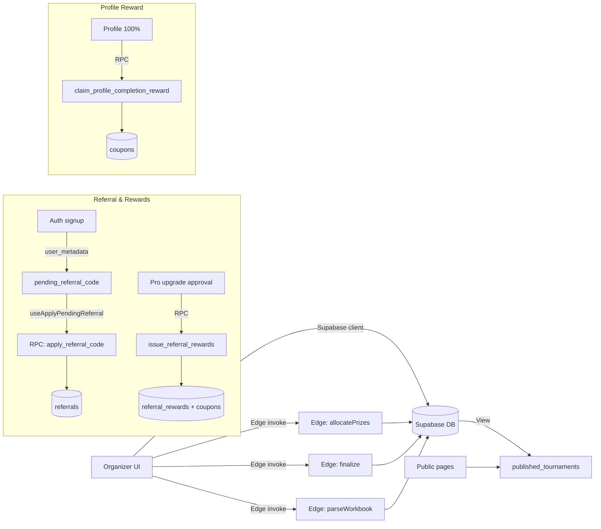

# Architecture & Data Model (repo-grounded)

## High-level architecture
- **Frontend (React + Vite):** Routes are defined in `App.tsx` and render page components for public, auth, and organizer flows. (src/App.tsx → App)
- **Pages:** Organizer pages include Dashboard, TournamentSetup, PlayerImport, ConflictReview, Finalize, FinalPrizeView, Settings, and PublishSuccess. (src/App.tsx → App)
- **Public pages:** PublicHome, PublicTournamentDetails, PublicResults, and PublicWinnersPage are public routes. (src/App.tsx → App)
- **Hooks:** Data fetching for final prize views, finalize, and imports uses hooks like `useFinalPrizeData`, `useFinalizeData`, and `useExcelParser`. (src/hooks/useFinalPrizeData.ts → useFinalPrizeData; src/hooks/useFinalizeData.ts → useFinalizeData; src/hooks/useExcelParser.tsx → useExcelParser)
- **Edge functions:** Allocation, team prizes, import parsing, finalize, and public team prize results are handled by Supabase edge functions. (supabase/functions/allocatePrizes/index.ts → Deno.serve; supabase/functions/allocateInstitutionPrizes/index.ts → Deno.serve; supabase/functions/parseWorkbook/index.ts → Deno.serve; supabase/functions/finalize/index.ts → Deno.serve; supabase/functions/publicTeamPrizes/index.ts → Deno.serve)

## Supabase objects (tables, views, functions, policies)
- **Core tables used by the app:**
  - `tournaments`, `categories`, `prizes`, `players`, `allocations`, `conflicts`, `rule_config`, `publications`, `institution_prize_groups`, `institution_prizes`, `user_roles`, `import_logs`, `profiles`, `coupons`, `coupon_redemptions`, `tournament_payments`, `tournament_entitlements`, `referral_codes`, `referrals`, `referral_rewards`, `audit_events`. (src/integrations/supabase/types.ts → Database.public.Tables)
- **Views:** `published_tournaments` is the public-safe view for published tournaments. (supabase/migrations/20251226184159_c2405569-73f6-4622-827f-3183c54b8645.sql → CREATE VIEW public.published_tournaments)
- **RPC/DB functions referenced by the client:** `list_my_tournaments`, `publish_tournament`, `has_role`, `apply_referral_code`, `get_or_create_my_referral_code`, `claim_profile_completion_reward`, `issue_referral_rewards`, `submit_tournament_payment_claim`, `review_tournament_payment`, `apply_coupon_for_tournament`, `redeem_coupon_for_tournament`, `admin_create_coupon`, `admin_list_coupons`, `bootstrap_master`. (src/integrations/supabase/types.ts → Database.public.Functions)

## Public read model
- Public pages query `published_tournaments`, which filters to `is_published = true` and excludes archived/deleted tournaments. (supabase/migrations/20251226184159_c2405569-73f6-4622-827f-3183c54b8645.sql → CREATE VIEW public.published_tournaments)
- Public results and details use the `published_tournaments` view via Supabase queries in the public pages. (src/pages/PublicResults.tsx → PublicResults; src/pages/PublicTournamentDetails.tsx → PublicTournamentDetails)
- Public team prize data is served by the `publicTeamPrizes` edge function, which verifies the tournament is published. (supabase/functions/publicTeamPrizes/index.ts → Deno.serve)

## Data flow (Mermaid)
- The following diagram reflects the UI → edge → DB flow used by import, allocation, finalize, and publication. (src/pages/PlayerImport.tsx → PlayerImport; src/pages/ConflictReview.tsx → ConflictReview; src/pages/Finalize.tsx → Finalize; supabase/functions/allocatePrizes/index.ts → Deno.serve; supabase/functions/finalize/index.ts → Deno.serve)

